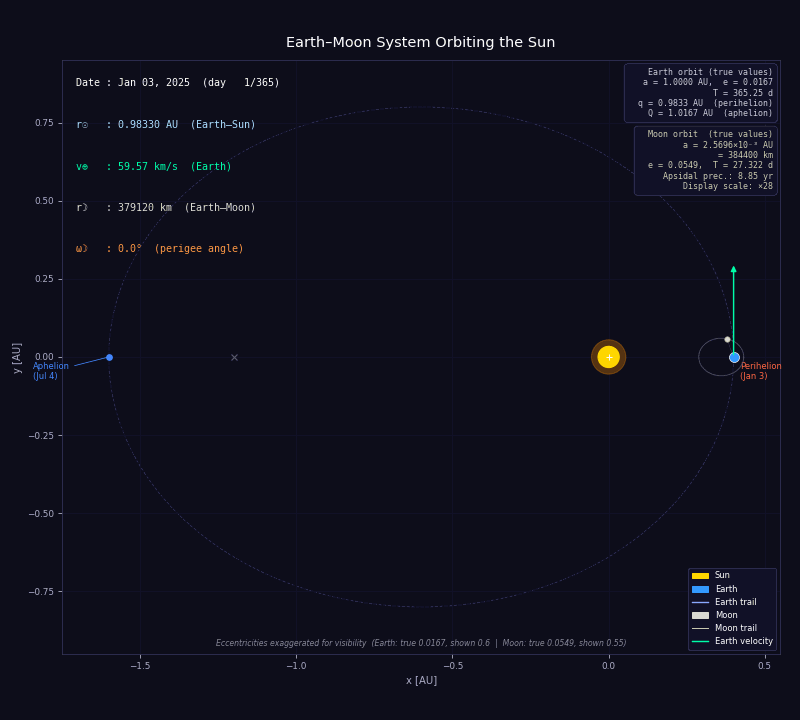

# Earth–Moon Orbits

A physics-based animation of the Earth–Moon system orbiting the Sun, using Kepler's equation with real astronomical values.



---

## Features

- **Kepler's equation** solved via Newton–Raphson iteration at every time step (`M = E − e sin E`)
- **Earth's elliptical orbit** with the Sun at one focus; perihelion and aphelion marked
- **Moon's geocentric orbit** added to Earth's heliocentric position each frame
- **Apsidal precession**: the Moon's perigee rotates 360° in ~8.85 years (~40.6°/yr), implemented by rotating the perifocal frame by ω(t) = Ω̇ · t
- **Analytical velocity vectors** for Earth, computed from dE/dt = n / (1 − e cos E)
- **Real astronomical values** displayed in HUD and info boxes (distances, speeds, anomaly angle)
- **Exaggerated eccentricities** for visual clarity — Earth: true 0.0167, shown 0.60; Moon: true 0.0549, shown 0.55 — while the true values are shown in readouts
- **Moon orbit ring** rendered each frame as a rotated ellipse tracking the precessing perigee
- **Date readout** advancing from perihelion (Jan 3) through one full year

---

## Known simplifications

| What is omitted | Why it matters |
|---|---|
| Orbital inclination | Earth's orbit is tilted ~7° to the Sun's equator; Moon's orbit is ~5.1° to the ecliptic |
| Nodal regression | The Moon's ascending node precesses with a ~18.6-year period |
| Axial tilt / seasons | Earth's 23.4° axial tilt drives seasons; not represented here |
| Arbitrary Moon phase at t=0 | The Moon starts at a fixed mean anomaly offset (π/4); not tied to a real epoch |
| Solar perturbations on the Moon | The Sun's gravity measurably distorts the Moon's orbit |
| Relativistic precession | Mercury's ~43″/century GR contribution; negligible for Earth/Moon |

---

## How to run

```bash
# Install dependencies
pip install numpy matplotlib pillow

# Run the simulation (saves earth-moon-orbits.gif, then opens interactive window)
python main.py
```

The GIF is saved as `earth-moon-orbits.gif` in the working directory before the interactive window opens.

---

## Requirements

- Python 3.8+
- numpy
- matplotlib
- pillow

---

## References

- [Kepler's equation — Wikipedia](https://en.wikipedia.org/wiki/Kepler%27s_equation)
- [Apsidal precession — Wikipedia](https://en.wikipedia.org/wiki/Apsidal_precession)
- [Lunar orbit — Wikipedia](https://en.wikipedia.org/wiki/Lunar_orbit)
- [Orbital mechanics — Wikipedia](https://en.wikipedia.org/wiki/Orbital_mechanics)
